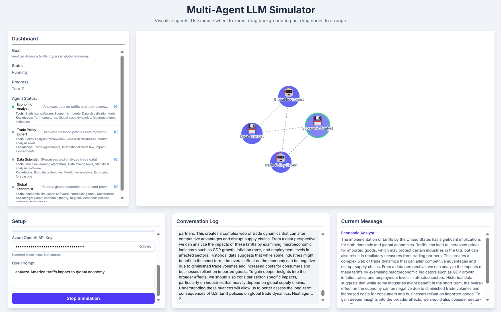

# Multi Agent Simulator

⚛️ **Refactored to Next.js (TypeScript)**: A Multi-Agent System Simulator 🤖 that uses Large Language Models (LLMs) to simulate agent interactions, visualize relationships, and facilitate collaborative goal achievement. Originally inspired by [this thread](https://x.com/algo_diver/status/1909257761013322112). The legacy standalone prototype remains in `ref/multi_agent_simulator.html` (untouched as requested).

## ✨ Features

- 🧠 **Agent Planning**: Dynamically generate agents, roles, and connections via OpenAI or Azure OpenAI (choose provider in UI).
- 🌐 **Visualization**: Interactive D3 force-directed graph (`AgentGraph` component) with zoom, drag, and animated speaking state.
- 🔄 **Simulation Loop**: Plan → iterative turns → next-speaker selection → summary.
- 📋 **Markdown Summary**: Final interaction summary rendered client-side.
- 🎨 **UI Stack**: Tailwind CSS, Radix Themes, shadcn-style button component, Lucide & Heroicons, Framer Motion transitions.
- ♻️ **Provider Abstraction**: Clean LLM layer in `lib/llm/providers.ts` supporting both OpenAI and Azure OpenAI endpoints.



## 🔁 New Features

- Fast Discussion Mode: shorter, ultra‑concise agent messages for rapid iteration.
- Max Turns & Convergence: set a turn cap; agents auto‑converge after 70% and force summary at limit.
- Early Stop Summary: stopping generates an immediate conclusion.
- Save / Load: persist state to localStorage or JSON.
- Export Conversation: download full simulation JSON (plan + history + settings).
- Height Constraints: graph & dashboard capped at 60% viewport height for better layout.
- Prompt Refinement: purely discussion-based (no real tool/code execution), delayed completion tag.

## 🗂 Project Structure (New)

```
app/
   page.tsx              # Main simulator UI
   api/sim/*             # Route handlers: plan, turn, next-agent, summary
components/
   AgentGraph.tsx        # D3 graph component
   ui/button.tsx         # Reusable button
lib/
   llm/                  # Prompts + providers abstraction
   types.ts              # Shared TypeScript interfaces
   utils.ts              # Tailwind class merge helper
ref/
   multi_agent_simulator.html  # Original single-file version (do not edit)
```

## 🔐 Environment Variables

Create `.env.local` and fill in values:

```
OPENAI_API_KEY=sk-...
OPENAI_MODEL=...

AZURE_OPENAI_ENDPOINT=https://your-resource.openai.azure.com
AZURE_OPENAI_API_KEY=...
AZURE_OPENAI_DEPLOYMENT=...
AZURE_OPENAI_API_VERSION=2024-05-01-preview
```

Only the selected provider's variables must be present. Missing vars for an unused provider are fine.

> Next.js automatically loads (earliest has lowest precedence):
> 1. .env
> 2. .env.local (ignored in git by default)
> 3. .env.development / .env.production / .env.test
> 4. .env.development.local / .env.production.local / .env.test.local
>
> For client-side exposure, prefix with `NEXT_PUBLIC_`. Variables without that prefix are server-only (e.g. route handlers / edge / server components).
>
> Azure OpenAI: deployment selects the model; `OPENAI_MODEL` is ignored when `provider=azure-openai`.

## 🚀 Setup & Run

```bash
# install (choose one)
pnpm install
# or
npm install
# or
yarn install

# develop
pnpm dev

# build / start
pnpm build && pnpm start
```

Visit: http://localhost:3000

## 🧭 How the Simulation Works

1. Client requests `/api/sim/plan` with goal → LLM returns JSON: `{ agents: [], links: [] }`.
2. First agent speaks via `/api/sim/turn`.
3. Next speaker decided by `/api/sim/next-agent` (LLM decision with round‑robin fallback).
4. Any agent can append `[GOAL_COMPLETE]` to trigger `/api/sim/summary`.
5. Summary rendered in the UI.

## 🧩 Extending Providers

Add Gemini or other providers by extending `buildClient` & creating new wrapper functions (maintain shared interface). Keep prompts in `lib/llm/prompts.ts` for consistency.

## 🛠 Tech Stack

- **Framework**: Next.js 15 (App Router, TypeScript)
- **Styling**: Tailwind CSS, Radix Themes
- **Icons**: Lucide, Heroicons, Material Symbols (loaded)
- **Animation**: Framer Motion
- **Graph**: D3.js
- **LLM SDK**: `openai` (works for both OpenAI & Azure OpenAI via custom baseURL + headers)

## ✅ Future Enhancements

- Token streaming for lower latency.
- Agent tool execution (web search, code eval) via server actions.
- Persistent session storage (DB) & multi-session management.
- Rich Markdown / code highlighting (swap lightweight parser).
- Tests (Vitest or Jest) for prompt formatting & provider fallbacks.

## 📄 License

MIT License.
